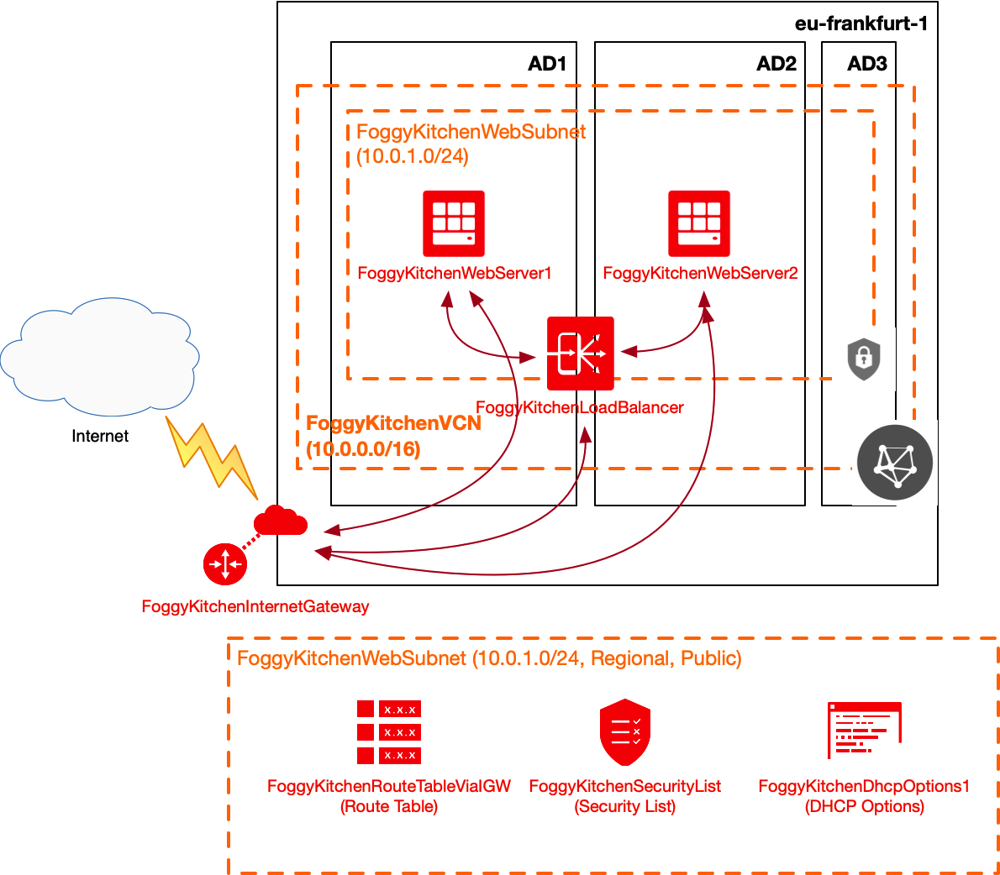

# FoggyKitchen Terraform OCI Course - **Windows version**

## How to use code from the lessons

### STEP 0.

We will be using windows Power Shell or Linux bash, depending on the operating system you choose.

**0.1 - Prepare SSH key pair**

In **Windows** or **Linux**, execute:

```
ssh-keygen
```

Answer to the questions asked:

In **Windows**:

Enter file in which to save the key: **/c/tmp/id_rsa** (we presume the c:\tmp\ directory existed already)

In **Linux**: 

Enter file in which to save the key: **/tmp/id_rsa** (we presume the /tmp/ directory existed already)

Enter passphrase: **"Enter" for no passphrase and then another time to confirm**

To show the contents of the public key:

In **Linux** or **Windows**

```
cat /tmp/id_rsa.pub
```


**0.2 - Prepare API Signing key**

In **Windows**, execute:

```
openssl genrsa -out /c/tmp/oci_api_key.pem 2048
openssl rsa -pubout -in /c/tmp/oci_api_key.pem -out /c/tmp/oci_api_key_public.pem
```

In **Linux**, execute:

```
openssl genrsa -out /tmp/oci_api_key.pem 2048
openssl rsa -pubout -in /tmp/oci_api_key.pem -out /tmp/oci_api_key_public.pem
```

To show the contents of the public key:

In **Linux** or **Windows**

```
cat /tmp/oci_api_key_public.pem
```

To associate it with an OCI user: go to **OCI menu > Identity > Users** and select a user with appropriate authorizations that should be able to create the desired infrastructure, then select the **API Keys** menu and press the **Add Public Key** button. Paste the public key value shown in the shell. Save the user's OCID for later use.


To verify the key's fingerprint, check that the value shown for the uploaded key is the same as shown in the shell:

In **Windows**:

```
openssl rsa -pubout -outform DER -in /c/tmp/oci_api_key.pem | openssl md5 -c
```

In **Linux**:

```
openssl rsa -pubout -outform DER -in /tmp/oci_api_key.pem | openssl md5 -c
```

Save the fingerprint value for later use.

### STEP 1. - Install the Terraform binary

If not installed yet, follow the installation guide: https://learn.hashicorp.com/terraform/getting-started/install.html 

Find your platform and download the latest version of your terraform runtime. Add directory of terraform binary into PATH and check terraform version:


To verify the terraform binary was correctly installed, execute:

```
terraform --version

  Terraform v0.12.24
```

### STEP 2.

1.1: Clone the repo from github by executing the command as follows and then go to foggykitchen_tf_oci_course directory:

```
git clone https://github.com/aorcl/foggykitchen_tf_oci_course.git

Cloning into 'foggykitchen_tf_oci_course'...
remote: Enumerating objects: 121, done.
remote: Counting objects: 100% (121/121), done.
remote: Compressing objects: 100% (89/89), done.
remote: Total 258 (delta 73), reused 79 (delta 32), pack-reused 137
Receiving objects: 100% (258/258), 68.71 MiB | 23.28 MiB/s, done.
Resolving deltas: 100% (142/142), done.
```

Navigate to the repository 

```
cd foggykitchen_tf_oci_course

ls 

    Directory: C:\Users\adolgano\Documents\DEVELOPMENT\github\aorcl\foggykitchen_tf_oci_course


Mode                LastWriteTime         Length Name
----                -------------         ------ ----
d-----       28/04/2020     16:55                LESSON3_load_balancer
-a----       28/04/2020     16:55             31 .gitignore
-a----       28/04/2020     17:53          23417 README.md
-a----       28/04/2020     17:53          235   CONTRIBUTORS.md
```

### STEP 3. 

Go to the lesson directory and create an environment file with 'TF_VAR_' variables:

#### If Windows:

```
cd LESSON3_load_balancer
code setup_oci_tf_vars.ps1
```

Enter this content into the powershell batch file, replacing the tenancy-specific IDs with your's:

```
$env:TF_VAR_user_ocid="ocid1.user.oc1..aaaaaaaaaqyobrezj7wnjk5zt2q6(...)mxvepdcr23z5kor4v5ceea"
$env:TF_VAR_tenancy_ocid="ocid1.tenancy.oc1..aaaaaaaalvbbkqilwful6cmkqa(...)whbevh5wjlsl6zpzm4ibj4a"
$env:TF_VAR_compartment_ocid="ocid1.compartment.oc1..aaaaaaaap4dw4cmk23(...)tslzljkw3h2fglgnb7g44p7tva"
$env:TF_VAR_fingerprint="91:e6:56:0c:6a:(...):f0:f3:22:bb:bd:eb:9d:eb"
$env:TF_VAR_private_key_path="c:\tmp\oci_api_key.pem"
$env:TF_VAR_region="eu-frankfurt-1"
$env:TF_VAR_public_ssh_key="ssh-rsa AAAAB3NzaC1yc2EAAAADAQABAAABAcz9dr58(...)"
$env:TF_VAR_NewCompartment="TerraformWorkshop"
```

save, then execute the file to set the variables:

```
./setup_oci_tf_vars.ps1
```

You can later veryfy the variables were set, executing

```
gci env:TF_VAR_*
```

#### If Linux:

```
cd LESSON3_load_balancer
vi setup_oci_tf_vars.sh
```

Enter this content into the shell file, replacing the tenancy-specific IDs with your's:

```
export TF_VAR_user_ocid="ocid1.user.oc1..aaaaaaaaob4qbf2(...)uunizjie4his4vgh3jx5jxa"
export TF_VAR_tenancy_ocid="ocid1.tenancy.oc1..aaaaaaaas(...)krj2s3gdbz7d2heqzzxn7pe64ksbia"
export TF_VAR_compartment_ocid="ocid1.tenancy.oc1..aaaaaaaasbktyckn(...)ldkrj2s3gdbz7d2heqzzxn7pe64ksbia"
export TF_VAR_fingerprint="00:f9:d1:41:bb:57(...)82:47:e6:00"
export TF_VAR_private_key_path="/tmp/oci_api_key.pem"
export TF_VAR_region="eu-frankfurt-1"
export TF_VAR_public_ssh_key="ssh-rsa AAAAB3NzaC1yc2EAAAADAQABAAABAcz9dr58(...)"
export TF_VAR_NewCompartment="TerraformWorkshop"
```

save, then execute the file to set the variables:

```
source setup_oci_tf_vars.sh
```

You can later veryfy the variables were set, executing

```
env | grep TF_VAR
```

### STEP 4.

Run *terraform init* with upgrade option just to download the lastest neccesary providers for this lesson:

```
$ terraform init -upgrade

Initializing the backend...

Initializing provider plugins...
- Checking for available provider plugins...
- Downloading plugin for provider "null" (hashicorp/null) 2.1.2...
- Downloading plugin for provider "oci" (hashicorp/oci) 3.65.0...

The following providers do not have any version constraints in configuration,
so the latest version was installed.

To prevent automatic upgrades to new major versions that may contain breaking
changes, it is recommended to add version = "..." constraints to the
corresponding provider blocks in configuration, with the constraint strings
suggested below.

* provider.null: version = "~> 2.1"

Terraform has been successfully initialized!

You may now begin working with Terraform. Try running "terraform plan" to see
any changes that are required for your infrastructure. All Terraform commands
should now work.

If you ever set or change modules or backend configuration for Terraform,
rerun this command to reinitialize your working directory. If you forget, other
commands will detect it and remind you to do so if necessary.
```

### STEP 5.

Run *terraform apply* to provision the content of this lesson (type **yes** to confirm the the apply phase):

```
$ terraform apply

An execution plan has been generated and is shown below.
Resource actions are indicated with the following symbols:
  + create
 <= read (data resources)

Terraform will perform the following actions:

  # data.oci_core_vnic.FoggyKitchenBackendserver1_VNIC1 will be read during apply
  # (config refers to values not yet known)
 <= data "oci_core_vnic" "FoggyKitchenBackendserver1_VNIC1"  {

(...)

  # oci_load_balancer_listener.FoggyKitchenPublicLoadBalancerListener will be created
  + resource "oci_load_balancer_listener" "FoggyKitchenPublicLoadBalancerListener" {
      + default_backend_set_name = "FoggyKitchenPublicLBBackendset"
      + hostname_names           = (known after apply)
      + id                       = (known after apply)
      + load_balancer_id         = (known after apply)
      + name                     = "FoggyKitchenPublicLoadBalancerListener"
      + path_route_set_name      = (known after apply)
      + port                     = 80
      + protocol                 = "HTTP"
      + rule_set_names           = (known after apply)
      + state                    = (known after apply)

      + connection_configuration {
          + idle_timeout_in_seconds = (known after apply)
        }
    }

Plan: 49 to add, 0 to change, 0 to destroy.

Do you want to perform these actions?
  Terraform will perform the actions described above.
  Only 'yes' will be accepted to approve.

  Enter a value: yes

(...)
oci_identity_compartment.ExternalCompartment: Creating...
oci_identity_compartment.FoggyKitchenCompartment: Creating...
oci_identity_compartment.ExternalCompartment: Creation complete after 2s [id=ocid1.compartment.oc1..aaaaaaaatanq4gogyxvneubmw3nf6gmegvzyh6ylqq4c3u2i3nc36jhdemda]
oci_identity_compartment.FoggyKitchenCompartment: Creation complete after 2s [id=ocid1.compartment.oc1..aaaaaaaagillnk7ttj6wpdhmewpibpxc5gbmrfxdtmaa3gfgjzbudesm3tsq]
oci_identity_policy.FoggyKitchenLPGPolicy1: Creating...

(...)

oci_database_db_system.FoggyKitchenDBSystem: Still creating... [21m11s elapsed]
oci_database_db_system.FoggyKitchenDBSystem: Still creating... [21m21s elapsed]
oci_database_db_system.FoggyKitchenDBSystem: Still creating... [21m31s elapsed]
oci_database_db_system.FoggyKitchenDBSystem: Still creating... [21m41s elapsed]
oci_database_db_system.FoggyKitchenDBSystem: Still creating... [21m51s elapsed]
oci_database_db_system.FoggyKitchenDBSystem: Still creating... [22m1s elapsed]

(...)

oci_database_db_system.FoggyKitchenDBSystem: Modifications complete after 2m8s [id=ocid1.dbsystem.oc1.eu-frankfurt-1.abtheljrbanqwij36gqnj7eya3yvkilc5ieflw3ukh6hkwtbuj7oeuaylx6a]
data.oci_database_db_nodes.DBNodeList: Refreshing state...
data.oci_database_db_node.DBNodeDetails: Refreshing state...
data.oci_core_vnic.FoggyKitchenDBSystem_VNIC1: Refreshing state...

Apply complete! Resources: 49 added, 0 changed, 0 destroyed.

Outputs:

FoggyKitchenBackendserver1_PrivateIP = [
  "192.168.1.2",
]
FoggyKitchenBastionServer_PublicIP = [
  "130.61.57.119",
]
FoggyKitchenDBServer_PrivateIP = [
  "10.0.4.2",
]
FoggyKitchenPublicLoadBalancer_Public_IP = [
  [
    "132.145.242.177",
  ],
]
FoggyKitchenWebserver1_PrivateIP = [
  "10.0.2.2",
]
FoggyKitchenWebserver2_PrivateIP = [
  "10.0.2.3",
]
```

### STEP 6.

After testing the environment you can remove the lesson's content. You should just run *terraform destroy* (type **yes** for confirmation of the destroy phase):

```
$ terraform destroy

oci_identity_compartment.FoggyKitchenCompartment: Refreshing state... [id=ocid1.compartment.oc1..aaaaaaaagillnk7ttj6wpdhmewpibpxc5gbmrfxdtmaa3gfgjzbudesm3tsq]
oci_identity_compartment.ExternalCompartment: Refreshing state... [id=ocid1.compartment.oc1..aaaaaaaatanq4gogyxvneubmw3nf6gmegvzyh6ylqq4c3u2i3nc36jhdemda]
oci_file_storage_file_system.FoggyKitchenFilesystem: Refreshing state... [id=ocid1.filesystem.oc1.eu_frankfurt_1.aaaaaaaaaaabenqnmzzgcllqojxwiotfouwwm4tbnzvwm5lsoqwtcllbmqwtcaaa]
(...)
Plan: 0 to add, 0 to change, 49 to destroy.

Do you really want to destroy all resources?
  Terraform will destroy all your managed infrastructure, as shown above.
  There is no undo. Only 'yes' will be accepted to confirm.

  Enter a value: yes

null_resource.FoggyKitchenWebserver1_oci_u01_fstab: Destroying... [id=3529939257266357221]
null_resource.FoggyKitchenWebserver2SharedFilesystem: Destroying... [id=95791244474403118]
null_resource.FoggyKitchenWebserver1SharedFilesystem: Destroying... [id=4614169576253275506]
null_resource.FoggyKitchenWebserver2SharedFilesystem: Destruction complete after 0s
null_resource.FoggyKitchenWebserver1SharedFilesystem: Destruction complete after 0s

(...)

oci_core_virtual_network.FoggyKitchenVCN: Destroying... [id=ocid1.vcn.oc1.eu-frankfurt-1.aaaaaaaajyphwxm26aqbfzd4er4u7wkqetcasmxv4izm7cvqu6jdvztj2cpa]
oci_core_local_peering_gateway.FoggyKitchenLPG2: Destruction complete after 0s
oci_core_virtual_network.FoggyKitchenVCN2: Destroying... [id=ocid1.vcn.oc1.eu-frankfurt-1.aaaaaaaaqwjipowxnpyyo37skinezkhbxs7t3fsaeo4gfhaydkzjajuhvdmq]
oci_core_virtual_network.FoggyKitchenVCN: Destruction complete after 0s
oci_core_virtual_network.FoggyKitchenVCN2: Destruction complete after 1s
oci_identity_policy.FoggyKitchenLPGPolicy2: Destroying... [id=ocid1.policy.oc1..aaaaaaaaewh6rmehovenbdluf3qhm6tafb3qsdefqphujvpgocsnsbhlifca]
oci_identity_policy.FoggyKitchenLPGPolicy2: Destruction complete after 0s
oci_identity_compartment.FoggyKitchenCompartment: Destroying... [id=ocid1.compartment.oc1..aaaaaaaagillnk7ttj6wpdhmewpibpxc5gbmrfxdtmaa3gfgjzbudesm3tsq]
oci_identity_compartment.ExternalCompartment: Destroying... [id=ocid1.compartment.oc1..aaaaaaaatanq4gogyxvneubmw3nf6gmegvzyh6ylqq4c3u2i3nc36jhdemda]
oci_identity_compartment.FoggyKitchenCompartment: Destruction complete after 0s
oci_identity_compartment.ExternalCompartment: Destruction complete after 0s

Destroy complete! Resources: 49 destroyed.

```

## Description and Topology diagram

(for the full list of lessons from the original repository, please refer to https://github.com/mlinxfeld/foggykitchen_tf_oci_course )

### LESSON 3 - Load Balancer

In this lesson, we will introduce the OCI Public Load Balancer. Load Balancer's Listener entity will be visible on the Internet, which means you will have an additional public IP address. On the other hand Load Balancer's Backendset with Backends will be associated with both Webserver VMs. The outcome of this training is very simple. You can access web servers via the Load Balancer. Reload webpage a couple of times and you should expect index.html page to be different depends on what web server has been chosen by the Load Balancer. 


